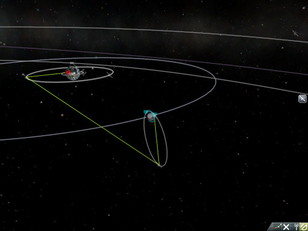
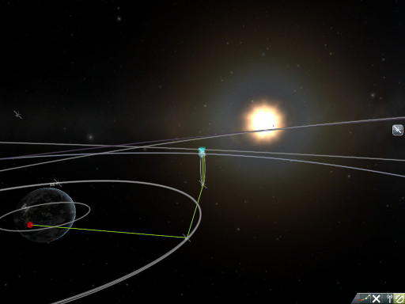
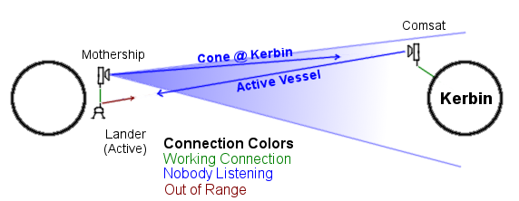



**Oh shit son!** This page is still under development!
{: .alert .alert-danger}

#RemoteTech Player's Guide



##Playing RemoteTech

###Antenna Configuration

With the exception of the Reflectron DP-10, all antennas start deactivated, both to save power and to protect the more delicate antennas from the rigors of launch. To activate an antenna (or to deactivate an unneeded one), right click on the antenna, then click "Activate" (or "Deactivate"). Antennas can also be activated or deactivated using action groups, or preset by right-clicking on them in the VAB. Activating an antenna counts as a command: you **cannot** activate an antenna unless you have an on-board crew, a working connection through another antenna, or an attached launch clamp. Deactivate your last antenna at your peril!

Omnidirectional antennas will automatically [connect](#connection-rules) to any antenna they can as soon as they are activated. Dish antennas must also be given a [target](#targeting). Targets may be selected either before or after the dish is activated. To set a target, right-click on the antenna and click the button marked "Target: None". This will pull up a window listing all planets and moons, as well as everything around them with an antenna. You may select a planet or moon to use [Cone Mode](#target_cone), a ship or "Mission Control" for a [Direct Link](#target_direct), or [Active Vessel](#target_active) to always target the ship you are flying. To create a link, the other ship may need to target your ship as well.

You do not need to place your satellite in any special orientation to use a dish antenna. As long as the targets are set correctly, the dish will connect, even if it is "really" facing the other way!

If necessary, you can send an EVA to open, close, or retarget an antenna from the outside. This is usually the only way to restore contact with a probe whose antennas are all shut down. Simply float up to the antenna, right click on it, and select the command you want to force.

###The Map View

RemoteTech adds an overlay to the map view to display the state of your communication network. The overlay may be toggled with the bottons located on the lower right: 

:   This button will highlight the links used in the working connection (if any) as a green line.

:   This button will display a 2D outline of any cones being aimed at planets or moons. For clarity, cones from ships off the edge of the screen will not be shown.

:   This button cycles through four views of the network: no overlay, all omni-to-omni links in light brown, all dish-to-dish or omni-to-dish links in orange, and all links.

:   This button pulls up a window listing all dishes on the current craft, as well as their targets. Dishes marked in green are activated, those marked in red are deactivated. Clicking on any dish in the list will pull up the target selection window for that dish.

The Kerbal Space Center and any remote command stations will be marked on the map with red dots. This overlay cannot be toggled.

RemoteTech also adds one button to the right side of the map view, below the planet info/ship crew button. Clicking this button will open a list of loaded ships; clicking on any ship on the list will center the map view on that ship.

###The Flight Computer

RemoteTech adds two new displays below the mission clock in the upper left corner. The first is the connection status. If it reads "D+", the number after it is the signal delay in seconds. You cannot make the ship execute any command faster than this time, which increases as you go farther from mission control. If it reads "No connection", you can't send commands at all. Finally, "Local Control" means that the ship has either a crewed pod or a [non-RemoteTech-compatible](../modders/) probe core, and you can control the ship with no delay as in the stock game.

The second element is a colored calculator icon -- green for a [working connection](../#connections), red for a broken connection, and yellow for local control. Clicking the icon while green or red pulls up the flight computer window. You can't use the flight computer if you have local control.

The basic flight computer window shows only the controls for operating it; clicking ">>" will display the computer's current state as well as a queue of any "instant" commands sent to it. Instant commands are anything you normally do once, including right-click actions, staging commands, action groups, and anything with a toggle key (RCS, SAS, landing gear...). They do not include slewing, translation, changing the throttle, or anything else that normally involves holding down a key. An instant command may be canceled by clicking the "X" button next to the command. Non-instant commands cannot be canceled.

####Signal delay

All commands, instantaneous and otherwise, are subject to signal delay, whether or not the flight computer's window is open. Instant commands will be shown in the queue along with the amount of time remaining until the probe receives the command. Once the time drops to zero, the command will be executed. Cancellations also count as commands and appear in the queue, along with a signal delay. Unless you are using manual delay (see below), there is no way to get a cancel command to the ship before it starts executing the original command.

If a command pulls up a window, you may press buttons in the window without signal delay. For example, if you have a two-minute delay and activate a science experiment, you have to only wait two minutes, not four, before the probe discards, saves, or transmits the data.

####Manual delay

The text box in the lower right corner of the computer window lets you choose to delay an action by a specific amount. This is useful if you expect to go out of contact, but want the probe to carry out a command while out of reach. To set the manual delay, type a delay into the box *and hit enter*. Merely typing the delay does nothing. Numbers with no units will be interpreted as seconds; otherwise, you need to give exact units -- "1m20s" will be parsed as one minute and twenty seconds, while "1m20" will be treated as bad input. Once a manual delay is set, any command, instant or not, will be delayed, whether the flight computer window is open or not. **Remember to set your delay to zero when you're done!**

If the manual delay is less than the signal delay, the delay will be ignored -- the probe will execute the command as soon as it gets it, just as if the delay were zero. If the manual delay is more than the signal delay, the computer queue will list two delays: the first is the signal delay, while the second is the amount the computer will wait after it gets the signal. Manual delays are always relative to the time the command was sent, not when it was received.

**Example:** a probe is ten light-minutes away and about to pass behind a planet for a burn, which is scheduled 20 minutes from now. Type "20m" into the delay box and hit enter to set it as the current delay. Then issue a command to (for example) point retrograde. The flight queue will read "9m56s+10m00s", indicating that the signal will take just under ten minutes to reach the ship, followed by ten minutes before the ship acts on it.

Cancellations are not affected by manual delay, so a command will be removed from the queue as soon as the cancellation reaches the ship. This makes manual delay helpful if you want to review a complex sequence of commands before they are executed.

####Autopilot commands

The buttons on the left side of the screen control a simple autopilot. All buttons are instant actions, so they are saved in the queue and may be canceled. Like all commands, they are subject to signal delay and manual delay. The buttons are as follows:

#####Attitude Control

Pointing a ship with several minutes of lag is nearly impossible, so the computer can be programmed to hold a particular position. Choosing any attitude will immediately override the previous attitude command. The path the ship takes in pointing toward a new position can be very roundabout, so be sure to allow plenty of time to turn the ship before a burn.

There are six basic positions:

GRD+
:   points the ship prograde

GRD-
:   points the ship retrograde

RAD+
:   points the ship outward

RAD-
:   points the ship inward

NRM+
:   points the ship up, out of its orbital plane

NRM-
:   points the ship up, out of its orbital plane

Clicking on a position once it's already selected will revert to prograde.

Three of the buttons at the top of the screen, marked "ORB", "SRF", and "RVEL", will decide if prograde/retrograde/etc. are measured relative to the ship's orbital motion, relative to its surface motion, or relative to its target's motion. The effects are identical to clicking through the three velocity displays at the top of the navball. A fourth button, "TGT", will have prograde pointing directly at the target instead of the relative velocity vector. Clicking on a reference frame once it's already selected will turn off the flight computer's attitude control.

The other attitude options, which don't work with the six position buttons, are:

KILL
:   this attempts to hold the ship in a fixed direction. While less subtle than SAS, it is useful for maintaining attitude in the middle of a sequence, because SAS can't run while the flight computer is running any attitude control commands.

NODE
:   this attempts to face the direction required for the next maneuver node.

CUSTOM
:   this attempts to keep the ship in a specific pitch, yaw, and roll, as chosen by the options below the six position buttons.

#####Executing Maneuver Nodes

Pressing the "EXEC" button causes the ship to wait until it reaches a maneuver node, then slew to the maneuver position and start the engine for a precalculated amount of time. Once the length of the burn has passed, the flight computer will shut off the engine. Automatic node execution overrides any attitude control commands, and once the execution is done the flight computer switches off. The player may need to schedule post-burn commands such as KILL or "Toggle SAS" to keep the ship pointed.

**Note:** the flight computer does not understand staging, and will continue to count down to the end of the burn even if the current fuel tanks are empty. Schedule any staging commands separately.

Because node execution does not wait for the ship to face the node before turning on the engine, players are *strongly* encouraged to use a NODE attitude command well before executing a maneuver node. The management is not responsible for any burns that had the opposite of their intended effect.

Unlike most commands, EXEC ignores manual delays -- the time of the burn is set by the location of the maneuver node. If the time to the node is less than the signal delay, the execution command won't be sent.

#####Manual Burns

Automatic node execution has a few limitations: it needs a well-defined maneuver node, making it difficult to do small velocity corrections, it doesn't start the burn until it passes the node, which may make long burns less accurate, and it ignores any nodes after the first. For more control over burns, players may set the burn parameters by hand.

First, adjust the throttle slider to the desired intensity of the burn (as a safety measure, the default is no thrust). In the box, type either the desired duration of the burn, or the desired delta-V (e.g., "100 m/s"). The delta-V will be converted to a burn time; the flight computer **will not** adjust the burn while it's happening to get the right delta-V. Clicking "BURN" will add the burn to the command queue, with signal delay and whatever manual delay was set.

Just like automatic node execution, the manual burn doesn't understand staging or attitude control. Those commands must be scheduled separately.

##Connection Rules

To have a [working connection](../#connections) to the Kerbal Space Center (KSC) or a [remote command station](#command-stations), there must be an unbroken chain of links between satellites and between a satellite and the command center. There is no limit to the number of links in the chain, but *all* links must be valid to establish a connection. An example with three links is shown below. If multiple paths through the network are available, RemoteTech will always choose the shortest, minimizing [signal delay](#signal-delay).

{:.pairedimages} 
{:.pairedimages}

**Example:** this probe in low Munar orbit can't link to the Kerbal Space Center (KSC) because the probe is on the far side of the Mun. However, it can link to a relay satellite in polar orbit. The relay can't link to KSC, either, because KSC is on the other side of the planet. However, it can link to any of several communications satellites orbiting Kerbin (for clarity, only the best connection is shown). One of these satellites can link to KSC. Therefore, the probe has a working connection with KSC, as relayed by the two intermediate satellites, even though there are nearly 1600 km of solid rock blocking a direct transmission.
{:.caption}

A link will be formed between two satellites if, and only if, three conditions are met. For the purposes of these rules, Mission Control at the Kerbal Space Center (KSC) is considered a grounded satellite with a [special omnidirectional antenna](#omnidirectional-antennas).

###Line of Sight

The first condition is that there must not be a planet or moon blocking the line of sight between the two satellites. Line of sight calculations assume all planets are perfect spheres, so mountains and other terrain will not affect line of sight.

###Range

The second condition is that *both* satellites must have an antenna that can reach as far as the other satellite. A special case is that a link to KSC is impossible unless the satellite establishing the link is within [75,000 km](#omnidirectional-antennas) of Kerbin. Any connections from farther out will need to go through at least one relay.

**Example:** a probe with a Communotron 16 antenna (range 2500 km) and a probe with a CommTech-1 dish (350,000,000 km) are located 3000 km apart. Although the CommTech-1 is one of the most powerful dishes in RemoteTech, the two probes cannot link because the first probe can never link to anything more than 2500 km away. Unless, of course, it has a longer-range antenna in addition to the Communotron 16.

###Targeting

The third, and most complex, condition applies only to dish antennas. To establish a link, a dish with sufficient range must be *targeted* at the other satellite, either directly or indirectly. If the other satellite is also trying to connect through a dish rather than an omnidirectional antenna, it must target the first satellite as well. There are three ways to target a satellite:

{::comment}
What's going on here? The kramdown manual says "The column number of the first non-space character which appears after a definition marker on the same line specifies the indentation that has to be used for the following lines of the definition.", but no style information gets applied!
{:/comment}

Direct Link
:   {:#target_direct}if the dish's target is set to a specific satellite, or to KSC Mission Control, it will maintain a link to that target as long as the line of sight and range conditions are met. A dish in Direct Link mode cannot be used to make connections with anything other than its specific target. Direct link mode is recommended for situations where the other two modes won't work, because updating direct links as ships move around can be a lot of work.

Cone
:   {:#target_cone}if the dish's target is set to a planet or moon, it can simultaneously maintain a link to all targets that are within a cone centered on that planet *and* that are within that planet or moon's sphere of influence. The [list of parts](#dish-antennas) includes the cone diameter for each dish, as well as the minimum distance the dish needs to be from Kerbin to see anything to the side of the planet or to see anything in synchronous orbit (if you're too close, you'll get the situation in the picture). Cone mode is recommended for links to relay satellites orbiting another planet or moon, as it will automatically choose the best relay at any moment. 

 
Active Vessel
:   {:#target_active}if the dish's target is set to "Active Vessel", it will attempt to contact the ship the player is currently flying as if that ship had been selected using Direct Link. Active Vessel targeting is meant for dedicated communications satellites or [remote command stations](#command-stations), where it prevents the player from having to manually re-target all their comsats every time they focus on a different mission. Active Vessel is best suited for contacting isolated ships where there is not enough demand for a dedicated link. It should **not** be used if the player wants to relay a transmission through a third ship, or you may run into the common situation below:

**Example:** a mothership is in orbit around a planet and has just detached a lander. Both mothership and lander are equipped with omnidirectional antennas; the mothership also has a dish that is pointed at Kerbin in cone mode. In orbit around Kerbin is a comsat with one of its dishes set to Active Vessel. If the player is controlling the lander, the comsat tries to link directly to it, bypassing the mothership entirely. The lander's antenna is too short to link to the comsat, and the mothership can't link because the comsat isn't trying to link to the mothership. To establish a connection, the comsat needs to either target the mothership with a **direct link**, or target the planet with a **cone**. Either would create a link between comsat and mothership, letting the mothership act as a relay for the lander.
{:.caption}

##List of Parts

###Probe Cores

All stock probe cores serve as [signal processors](../#signal_processors). In addition, the [RC-L01 Remote Guidance Unit](http://wiki.kerbalspaceprogram.com/wiki/RC-L01_Remote_Guidance_Unit) can serve as a [command station](../#command_stations), provided a crew of 6 or more kerbals is available to split the jobs of running the ship and sending instructions to nearby probes.

The probe cores are otherwise unchanged from their [stock versions](http://wiki.kerbalspaceprogram.com/wiki/Parts#Pods).

###Omnidirectional Antennas

{::comment}
Yes, the non-breaking spaces are necessary. Without them, when printing the table on a narrow screen, browsers won't be smart enough to realize that notes is the only column that word-wraps well, and will try to create eye-wrenching entries like 2500
km
{:/comment}

Part                | Cost | Mass            | Drag | Range          | Power Drain   | Notes
:-------------------|-----:|:----------------|------|---------------:|:--------------|:------
[Reflectron DP-10](#reflectron-dp-10) | 80   | 0.005&nbsp;tons | 0.2  |    500&nbsp;km | 0.01&nbsp;e/s | Activated on mission start. Not damaged by atmospheric flight
[Communotron 16](#communotron-16) | 150  | 0.005&nbsp;tons | 0.2  |   2500&nbsp;km | 0.13&nbsp;e/s | 
[CommTech EXP-VR-2T](#commtech-exp-vr-2t) | 550  | 0.02&nbsp;tons  | 0.0  |   3000&nbsp;km | 0.18&nbsp;e/s | 
[Communotron 32](#communotron-32) | 150  | 0.01&nbsp;tons  | 0.2  |   5000&nbsp;km | 0.6&nbsp;e/s  | 
KSC Mission Control |      |                 |      | 75,000&nbsp;km |               | Command Station
{:.data}

<!--All science transmissions with stock or RemoteTech antennas cost 7.5 charge per Mit, and they all drain 50 charge per second while transmitting science. This is in addition to the power drain listed in the table, which is for keeping the antenna active and searching for links.-->

####Reflectron DP-10

The Reflectron DP-10 is a lightweight omnidirectional antenna. Its omnidirectional nature and its ability to function in atmosphere even at high speeds make it an excellent choice for launches and landings, but its short range means it rapidly becomes useless outside low Kerbin orbit. Unlike other antennas, the DP-10 is active by default, although this state can be toggled in the antenna's right-click menu.

VAB Category: Science Parts
Tech to Unlock: [Flight Control](http://wiki.kerbalspaceprogram.com/wiki/Flight_Control)
Manufacturer: Parabolic Industries
Cost: 80
Mass: 0.005 tons
Drag: 0.2
Comlink power: 0.01 charge/s
Science power: 50 charge/s
Science efficiency: 7.5 charge/Mit

**Transmission Properties**
Maximum Range: 500 km
Reach: Any unbroken line of sight to KSC Mission Control, if below 150 km altitude

**Atmosphere Performance**
Does not break in atmospheric flight.

####Communotron 16

As in the stock game, the Communotron 16 is the starting omnidirectional antenna, essential for transmitting science from those early flights. It also forms the backbone of most players' low-orbit communications networks until the CommTech EXP-VR-2T and Communotron 32 are researched.

VAB Category: Science Parts
Tech to Unlock: [None](http://wiki.kerbalspaceprogram.com/wiki/Start)
Manufacturer: Ionic Protonic Electronics
Cost: 150
Mass: 0.005 tons
Drag: 0.2
Comlink power: 0.13 charge/s
Science power: 50 charge/s
Science efficiency: 7.5 charge/Mit

**Transmission Properties**
Maximum Range: 2500 km
Reach: Low Kerbin Orbit

**Atmosphere Performance**
Maximum ram pressure when deployed: 6 kN/m2
Maximum safe speed at sea level: 99 m/s
Maximum safe speed at 10 km: 269 m/s
Minimum safe altitude at 2300 m/s: 32 km

####CommTech EXP-VR-2T

The CommTech EXP-VR-2T is an advanced antenna unlocked late in the tech tree. It is mounted on an extendable boom, making it much more compact than the Communotron series when retracted, but slightly larger when deployed. It is slightly more powerful than the Communotron 16.

VAB Category: Science Parts
Tech to Unlock: [Specialized Electrics](http://wiki.kerbalspaceprogram.com/wiki/Tech_tree#Specialized_Electrics)
Manufacturer: AIES Aerospace
Cost: 150
Mass: 0.005 tons
Drag: 0.2
Comlink power: 0.13 charge/s
Science power: 50 charge/s
Science efficiency: 7.5 charge/Mit

**Transmission Properties**
Maximum Range: 3000 km
Reach: Low Kerbin Orbit

**Atmosphere Performance**
Maximum ram pressure when deployed: 6 kN/m2
Maximum safe speed at sea level: 99 m/s
Maximum safe speed at 10 km: 269 m/s
Minimum safe altitude at 2300 m/s: 32 km

####Communotron 32

The Communotron 32 is the most powerful omnidirectional antenna available in RemoteTech, capable of reaching past kerbosynchonous orbit and filling many moons' spheres of influence. However, it consumes a lot of energy when active.

VAB Category: Science Parts
Tech to Unlock: [Large Electrics](http://wiki.kerbalspaceprogram.com/wiki/Tech_tree#Large_Electrics)
Manufacturer: Ionic Protonic Electronics
Cost: 150
Mass: 0.01 tons
Drag: 0.2
Comlink power: 0.6 charge/s
Science power: 50 charge/s
Science efficiency: 7.5 charge/Mit

**Transmission Properties**
Maximum Range: 5000 km
Reach: Near-Kerbin space, synchronous orbit

**Atmosphere Performance**
Maximum ram pressure when deployed: 3 kN/m2
Maximum safe speed at sea level: 70 m/s
Maximum safe speed at 10 km: 190 m/s
Minimum safe altitude at 2300 m/s: 35 km

###Dish Antennas

{::comment}
Yes, the non-breaking spaces are necessary. Without them, when printing the table on a narrow screen, browsers won't be smart enough to realize that notes is the only column that word-wraps well, and will try to create eye-wrenching entries like 2500
km
{:/comment}

Antenna           | Cost | Mass            | Drag | Cone | Range          | Power Drain   | Notes
:-----------------|-----:|:----------------|------|:-----------|---------------:|:--------------|:------
[Comms DTS-M1](#comms-dts-m1) | 100  | 0.03&nbsp;tons  | 0.2  | 45&deg;    | 50,000&nbsp;km | 0.82&nbsp;e/s | 
[Reflectron KR-7](#reflectron-kr-7) | 100  | 0.5&nbsp;tons   | 0.2  | 25&deg;    | 90,000&nbsp;km | 0.82&nbsp;e/s | Not damaged by atmospheric flight
[Communotron 88-88](#communotron-88-88) | 900  | 0.025&nbsp;tons | 0.2  | 0.06&deg;  | 40M&nbsp;km    | 0.93&nbsp;e/s | 
[Reflectron KR-14](#reflectron-kr-14) | 100  | 1.0&nbsp;tons   | 0.2  | 0.04&deg;  | 60M&nbsp;km    | 0.93&nbsp;e/s | Not damaged by atmospheric flight
[CommTech-1](#commtech-1) | 800  | 1.0&nbsp;tons   | 0.2  | 0.006&deg; | 350M&nbsp;km   | 2.6&nbsp;e/s  | Not damaged by atmospheric flight
[Reflectron GX-128](#reflectron-gx-128) | 800  | 0.5&nbsp;tons   | 0.2  | 0.005&deg; | 400M&nbsp;km   | 2.8&nbsp;e/s  | 
{:.data}

<!--All science transmissions with stock or RemoteTech antennas cost 7.5 charge per Mit, and they all drain 50 charge per second while transmitting science. This is in addition to the power drain listed in the table, which is for keeping the antenna active and searching for links.-->

####Comms DTS-M1

The Comms DTS-M1 is the shortest-ranged of the directional dishes. Its wide cone makes it perfect for maintaining contact with multiple satellites within Kerbin's sphere of influence.

VAB Category: Science Parts
Tech to Unlock: [Science Tech](http://wiki.kerbalspaceprogram.com/wiki/Science_Tech)
Manufacturer: Ionic Symphonic Protonic Electronics
Cost: 100
Mass: 0.03 tons
Drag: 0.2
Comlink power: 0.82 charge/s
Science power: 50 charge/s
Science efficiency: 7.5 charge/Mit

**Transmission Properties**
Maximum Range: 50,000 km
Cone Diameter: 45&deg;
Cone covers Kerbin at: 1600 km
Cone covers kerbosynchronous orbit at: 9100 km
Reach: Minmus orbit

**Atmosphere Performance**
Maximum ram pressure when deployed: 6 kN/m2
Maximum safe speed at sea level: 99 m/s
Maximum safe speed at 10 km: 269 m/s
Minimum safe altitude at 2300 m/s: 32 km

####Reflectron KR-7

The Reflectron KR-7 is the second short-range antenna available from RemoteTech. It has a longer range than the Comms DTS-M1, making it well-suited for spacecraft beyond Minmus's orbit. However, its narrow cone reduces its effectiveness at the Mun's distance or closer. The Reflectron KR-7 is too sturdy to be ripped off by atmospheric flight, so if properly targeted it can replace the Reflectron DP-10 as a launch antenna.

VAB Category: Science Parts
Tech to Unlock: [Electrics](http://wiki.kerbalspaceprogram.com/wiki/Tech_tree#Electrics)
Manufacturer: Parabolic Industries
Cost: 100
Mass: 0.5 tons
Drag: 0.2
Comlink power: 0.82 charge/s
Science power: 50 charge/s
Science efficiency: 7.5 charge/Mit

**Transmission Properties**
Maximum Range: 90,000 km
Cone Diameter: 25&deg;
Cone covers Kerbin at: 2800 km
Cone covers kerbosynchronous orbit at: 16,000 km
Reach: Kerbin sphere of influence

**Atmosphere Performance**
Does not break in atmospheric flight.

####Communotron 88-88

The Communotron 88-88 is by far the lightest interplanetary antenna. It can easily reach all the inner planets, and can even contact Dres when it is on the same side of the sun as Kerbin. However, its narrow cone means that players will have to point it at a specific satellite if they wish to make course corrections while en route to Eve or Duna.

VAB Category: Science Parts
Tech to Unlock: [Electronics](http://wiki.kerbalspaceprogram.com/wiki/Electronics)
Manufacturer: Ionic Protonic Electronics
Cost: 1100
Mass: 0.025 tons
Drag: 0.2
Comlink power: 0.93 charge/s
Science power: 50 charge/s
Science efficiency: 7.5 charge/Mit

**Transmission Properties**
Maximum Range: 40,000,000 km
Cone Diameter: 0.06&deg;
Cone covers Kerbin at: 1,100,000 km
Cone covers kerbosynchronous orbit at: 6,600,000 km
Reach: Duna (all times), Dres (same side of sun only)

**Atmosphere Performance**
Maximum ram pressure when deployed: 6 kN/m2
Maximum safe speed at sea level: 99 m/s
Maximum safe speed at 10 km: 269 m/s
Minimum safe altitude at 2300 m/s: 32 km

####Reflectron KR-14

The Reflectron KR-14 is an intermediate-range interplanetary antenna. It can easily reach all the inner planets as well as Dres. Like the Communotron-88, the KR-14 has a narrow cone and will have difficulty "seeing" communications satellites if pointed directly at Kerbin from too close a range.

VAB Category: Science Parts
Tech to Unlock: [Large Electrics](http://wiki.kerbalspaceprogram.com/wiki/Tech_tree#Large_Electrics)
Manufacturer: Parabolic Industries
Cost: 100
Mass: 1.0 tons
Drag: 0.2
Comlink power: 0.93 charge/s
Science power: 50 charge/s
Science efficiency: 7.5 charge/Mit

**Transmission Properties**
Maximum Range: 60,000,000 km
Cone Diameter: 0.04&deg;
Cone covers Kerbin at: 1,700,000 km
Cone covers kerbosynchronous orbit at: 9,900,000 km
Reach: Dres (all times), Jool (same side of sun only), Eeloo (periapsis and same side of sun only)

**Atmosphere Performance**
Does not break in atmospheric flight.

####CommTech-1

The CommTech-1 is the first antenna capable of returning signals to Kerbin from the outer solar system. Despite the in-game description, it can reach any planet available in version 0.23 of the game, even Eeloo at apoapsis. However, it has an extremely narrow cone; players should avoid using the dish in cone mode until they pass the orbit of Dres. Even a satellite in orbit around Jool may have occasional connection problems when using cone mode, as it can approach within 52 million km of Kerbin.

VAB Category: Science Parts
Tech to Unlock: [Specialized Electrics](http://wiki.kerbalspaceprogram.com/wiki/Tech_tree#Specialized_Electrics)
Manufacturer: AIES Aerospace
Cost: 800
Mass: 1.0 tons
Drag: 0.2
Comlink power: 2.60 charge/s
Science power: 50 charge/s
Science efficiency: 7.5 charge/Mit

**Transmission Properties**
Maximum Range: 350,000,000 km
Cone Diameter: 0.006&deg;
Cone covers Kerbin at: 11,000,000 km
Cone covers kerbosynchronous orbit at: 66,000,000 km
Reach: Eeloo (all times)

**Atmosphere Performance**
Does not break in atmospheric flight.

####Reflectron GX-128

The Reflecton-GX-128 is the longest-range antenna available in RemoteTech. While it has, for all practical purposes, the same abilities as the CommTech-1, its foldable construction makes it much lighter.

VAB Category: Science Parts
Tech to Unlock: [Advanced Science Tech](http://wiki.kerbalspaceprogram.com/wiki/Tech_tree#Advanced_Science_Tech)
Manufacturer: Parabolic Industries
Cost: 800
Mass: 0.5 tons
Drag: 0.2
Comlink power: 2.80 charge/s
Science power: 50 charge/s
Science efficiency: 7.5 charge/Mit

**Transmission Properties**
Maximum Range: 400,000,000 km
Cone Diameter: 0.005&deg;
Cone covers Kerbin at: 14,000,000 km
Cone covers kerbosynchronous orbit at: 79,000,000 km
Reach: Eeloo (all times)

**Atmosphere Performance**
Maximum ram pressure when deployed: 6 kN/m2
Maximum safe speed at sea level: 99 m/s
Maximum safe speed at 10 km: 269 m/s
Minimum safe altitude at 2300 m/s: 32 km
