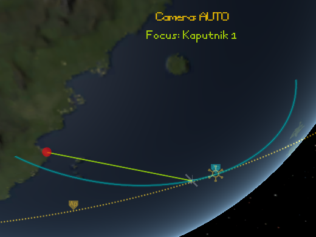
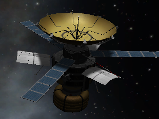
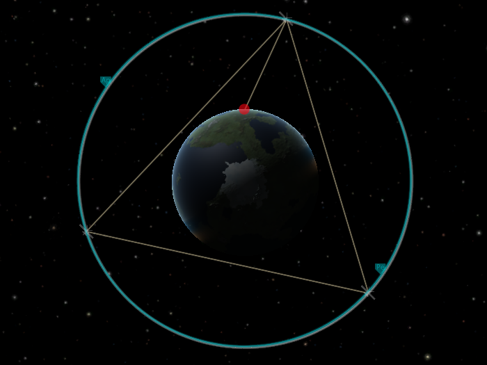
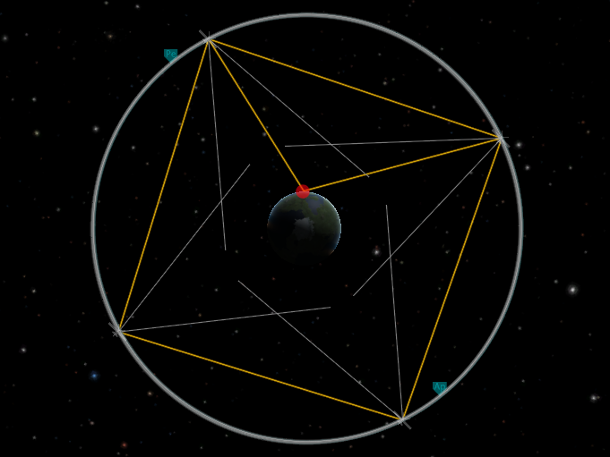
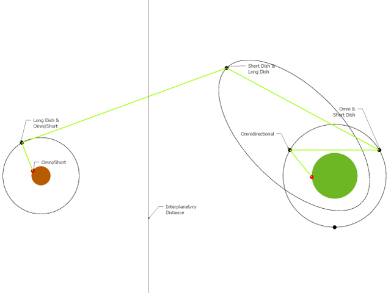
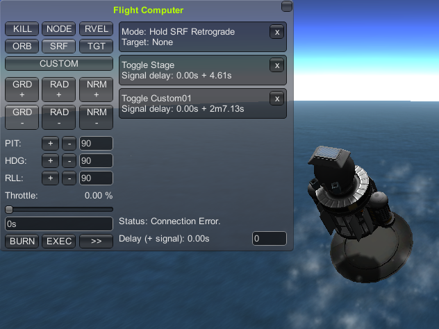



**UNDER CONSTRUCTION:** Please watch your step!
{: .alert .alert-danger}

#RemoteTech Tutorials



##Getting Started

###[Launching Your First Satellite](firstsat/)

##Setting Up Satellite Constellations

###[General Satellite Design Tips](comsats/)

###Kessler Network

###[Medium-Altitude Omni Network](c16network/)

###Cloverleaf Network

###["Realistic" Keosynchronous Relay](keo/)

##Long-Range Communications

###[Interplanetary Relay Networks](long_range/)

###Active Vessel Do's and Don'ts

##Using the Flight Computer Effectively

###Planetary Orbital Insertion

###[Kerbin Re-Entry](reentry/)

